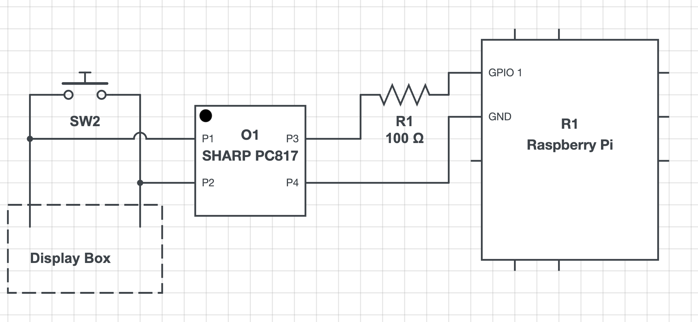

# elevationserver - Remotely Controlling a Standing Desk via Optocouplers on a Pi


# Backgroud

I was tasked with trying to reverse engineer the serial port on a standing desk so that we could manipulate it remotely on a raspberry pi for automated testing of a system. I did some probing of the serial connection, and even got to finally use my [Raspberry Pi debug probe](https://www.raspberrypi.com/products/debug-probe/) to try and read UART signals. While I did fetch some bytes, a replay attack failed to get the table manipulated over serial. Because this table has easily usable buttons, I decided instead to wire up optocouplers to press the buttons with a raspberry pi.

# The Server

The actual server that drives the table up and down is pretty simple. It just uses Flask and has one endpoint that you supply the percentage up or down you want the table to be positioned in addition to a root endpoint that tells you if the server is running. 

The way it manipulates the table is that I've set the 4 presets to be at 0, 33, 66, and 100 percent of the full height. Based on the value of the number, the Pi clicks a preset and then moves the table up or down to get as close to the specific percentage as possible. 0, 33, 66, and 100 are guaranteed to be stable amounts since they're presets while the other ones are closer to guesswork.

The OpenAPI spec in YAML form is [here](openapi.yaml) with HTML client docs [here](openapi-docs.html).


# How To Build this

## Prep the display for soldering

This table has a display unit with buttons that is connected to a controller unit via an RJ45 jack. Disconnect the RJ45 plug from the display unit and then unscrew the display unit from the table using a Philips head screwdriver. Then, remove the board it from the plastic shell using a Phillips head screwdriver to remove the 4 screws in the rear of the unit. Then remove the tape holding the metal circles where the buttons are to expose the pads that are bridged to trigger the buttons. With the board ready, we can now solder.

### Soldering

Using a soldering iron, we solder two wires to each button. While you could easily strip one end of a Dupont wire to get a connection from the board, I find these wires very difficult to solder to pads because the wires are very thin (often 28 AWG). That's why I reccomend using thicker non-terminated wire with an AWG closer to 22 AWG. As always with unleaded solder, remember to be liberal with your flux and use a helping hands to help hold the board in place. Also, test your solder joints for [continuity with a multimeter](https://www.wikihow.com/Test-Continuity-with-a-Multimeter)- you don't want any globs of solder shorting out buttons.

Once you've confirmed it all works, I'd recommend throwing some Kapton tape over the joints to protect them from shorting.


### Terminating with a Dupont Connector

I'm embarrased to say that I spent probably 1-2 hours terminating these wires because it took me a while to figure out how to get them to slip through the black dupont sleeve. I'm not going to try and explain it here, I'll just point you to a [youtube video that might explain it better](https://www.youtube.com/watch?v=jET1QTP1B7c
). Since these go on a breadboard, I'd reccomend terminating with male ends. Plus, if you can't get the sleeve on the metal, you can still just stick the pin in the breadboard.


### Optocoupler circuit

Optocouplers are great pieces of techology. They comprise of an LED and a phototransistor. On the control side of the optocoupler (in our case the raspberry pi), the controller is connected to an LED that it can turn on and off. On the other side of the optocoupler chip, the phototransistor connects the two pins if the LED is on, thereby isolating the two circuits, preventing any need for nasty buck converters or diodes to manipulate the other system. 


When wiring up our optocouplers (in our case a SHARP PC817), this is what you want the circuit to theoretically look like:



We need a resistor to drop the voltage so we don't burn out the LED, and we want the Pi to be entirely hooked up to the right legs of the optocoupler (the "control side") while the left legs connect the leads of the buttons to each side of the optocoupler to close the switch.

The optocouplers from gikfun off Amazon seemed to have various levels of wear, and even an in-spec resistor sometimes failed to trigger the phototransistor, requiring me to wire my resistors in parallel to drop the resistance. If it's not working, double check the wiring and then play around with different resistances.


### Connecting to a Pi and configuring your GPIO pins

To test the GPIO pins, I'd reccomend using the testPin.py file. But that can be a little annoying so if you want something even simpler, use this little script. My script uses the Broadcom mappings, so use the "GPIO X" number from https://pinout.xyz/ to figure out which one works.


```py 

import RPi.GPIO as GPIO
import time
 
pin = 21         # The pin connected to the LED
interval = .25   # The length of time to blink on or off

# Setting to BCM will use Broadcom's GPIO numbers, while using Pi will set it to the pi's physical pin count
GPIO.setmode(GPIO.BCM)
GPIO.setwarnings(False)
GPIO.setup(pin, GPIO.OUT)

# write to pin
GPIO.output(pin, GPIO.HIGH)
time.sleep(interval)
GPIO.output(pin, GPIO.LOW)

```

Then, you can fill in the correct pin mappings in `Config.py` that match how you wired it up:

```py
GPIO_LOOKUP = {
    "preset1": 17, # sets at 72
    "preset2": 6, # sets at 88
    "preset3": 13, # sets at 104
    "preset4": 5, # sets at 120
    "up": 26,
    "down": 27,
}
```


### Run the server


Since this is likely running on your own network, I'd reccomend adding a DHCP entry that points to the Raspberry Pi's IP. 

Bonus points for running the server as a systemd daemon too, that way you don't even need to SSH in when you reboot the pi. You can do this using the same tutorial from my [Oatmeal Computer Vision Server](https://github.com/evinjaff/oatmeal-cv-server?tab=readme-ov-file#run-it-as-a-systemd-service):


`elevationserver.service`
```toml
[Unit]
Description=Elevation Server
After=multi-user.target

[Service]
Type=idle
ExecStart=/path_to_this_repo/pi/venv/bin/python /path_to_this_repo/ElevationServer.py
StandardOutput=journal
StandardError=journal

[Install]
WantedBy=multi-user.target
```

Enable the service by typing `systemctl enable elevationserver.service`

Start the service by typing `systemctl start elevationserver.service`

Check that it worked by typing `systemctl status elevationserver.service`


## Mounting

Once you're sure that this works, you can mount it all up. I remixed a common raspberry pi mounting plate to include a tray to hold the display unit in addition to the breadboard. Should print ok with no supports needed. Here's a render of the 3D model, it's a little tight to put in the breadboard, but it will fit snugly.

